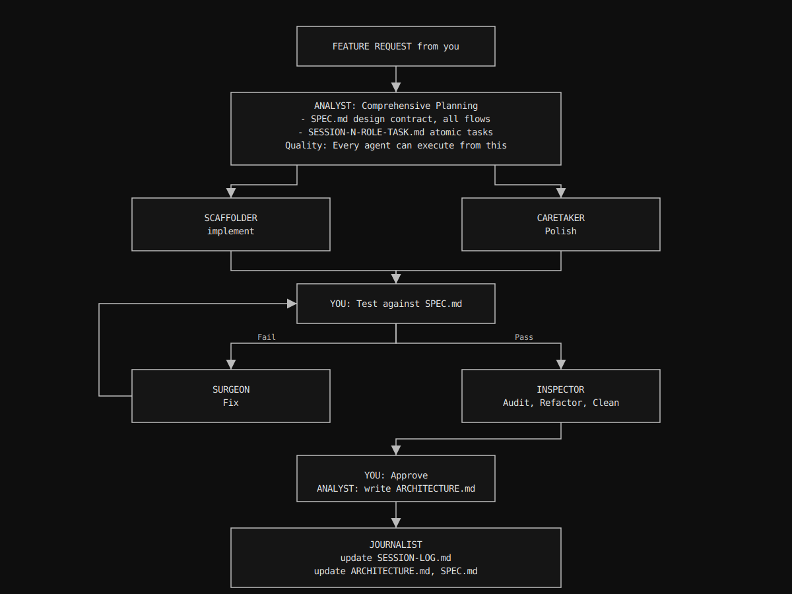

# CAROL

```
    ████████     ████     ██████████     ████████   ████
  ████░░░░░░   ████████   ████░░░░████ ████░░░░████ ████
████░░       ████░░░░████ ████    ████ ████    ████ ████
████         ████    ████ ██████████░░ ████    ████ ████
████         ████████████ ████░░████   ████    ████ ████
░░████       ████░░░░████ ████  ░░████ ████    ████ ████
  ░░████████ ████    ████ ████    ████ ░░████████░░ ████████████
    ░░░░░░░░ ░░░░    ░░░░ ░░░░    ░░░░   ░░░░░░░░   ░░░░░░░░░░░░
```

**C**ognitive **A**mplification **R**ole **O**rchestration for LLM agents

Version: 2.0.0

An opinionated ritualistic framework that enforces discipline to work with multiple agents simultaneously.

CAROL was never meant to be used for 100% vibing, you could if you want. But it helps agents from drifting from the course of development while maintaining human still responsible for every line of code.

CAROL also works effectively as a rapid prototyping methodology for experienced architects exploring unfamiliar stacks.

---

## 📖 Notation Reference

**[N]** = Sprint Number (e.g., `1`, `2`, `3`...)

**File Naming Convention:**
- `[N]-[ROLE]-[OBJECTIVE].md` — Task summary files written by agents
- `[N]-COUNSELOR-[OBJECTIVE]-KICKOFF.md` — Phase kickoff plans (COUNSELOR)
- `[N]-AUDITOR-[OBJECTIVE]-AUDIT.md` — Audit reports (AUDITOR)

**Example Filenames:**
- `[N]-COUNSELOR-INITIAL-PLANNING-KICKOFF.md` — COUNSELOR's plan for sprint 1
- `[N]-ENGINEER-MODULE-SCAFFOLD.md` — ENGINEER's task in sprint 2
- `[N]-AUDITOR-QUALITY-CHECK-AUDIT.md` — AUDITOR's audit after sprint 2

---

## Why

At its infancy, LLM agents are unreliable assistance for development. Commercial agentic models produce deterministic binary results—either they populate super fast thousands of lines of code that might work, or they give you piles of garbage that will exhaust your tokens, credits, time, patience, and eventually your sanity to debug.

LLMs suffer from:
- **Scope creep:** Adding features not requested
- **Cognitive overload:** Reading entire codebase, hitting sprint limits
- **Autonomous mistakes:** Making changes without asking
- **Inconsistent patterns:** Each agent invents new approaches

### Solution

**1. You maintain architectural coherence:** No agent can fuck up the big picture because you're the one holding it. You're validating intent at each handoff.

**2. Domain transfer without syntax debt:** Fuck MCP. You are the living embodiment of Human Context Protocol. You control the flow. You are the architect. The agents translate your architectural intent into the programming language syntax.

**3. Role-based constraints:** Each role has explicit behavioral rules and reads only what they need.

**Result:** Reduced failures, lower costs, faster development.

---

## What

CAROL is a role-based agent orchestration framework for collaborative software development. It's a cognitive load distribution system that prevents agent drift by enforcing specialized roles with explicit constraints and clear handoffs.

### Primary Agents (2)

**COUNSELOR** - Requirements Counselor & Planning Specialist
   Transforms conceptual intent into formal specifications. Asks clarifying questions, explores edge cases and constraints, writes comprehensive SPEC.md and ARCHITECTURE.md. Handles all documentation including SPRINT-LOG.md updates on "log sprint" command. Never writes code directly. Uses SPEC-WRITER.md and ARCHITECTURE-WRITER.md as guides to clarify user's architectural vision into formalized development documents.

**SURGEON** - Complex Fix Specialist
   Handles bugs, performance issues, edge cases, and architectural corrections that other agents cannot solve. Reads RESET context to ignore failed attempts, identifies root cause using PATTERNS.md debug methodology, implements minimal surgical fixes. Does not refactor entire modules or touch unrelated code.

### Secondary Agents (8)

**ENGINEER** - Literal Code Generator
   Implements features exactly as specified in kickoff documents. Generates boilerplate, structures, and straightforward implementations. Follows specifications literally without adding features, optimizations, or making architectural decisions. Uses exact names, types, and signatures from SPEC.md as referenced in kickoff plans.

**ORACLE** - Deep Reasoning Specialist
   Provides deep analysis and second opinions when invoked by COUNSELOR or SURGEON. Can read codebase (grep, cat, find) and research web for patterns. Returns structured analysis with trade-offs and recommendations. Never makes code changes—advisory only.

**LIBRARIAN** - Knowledge Curator
   Maintains PATTERNS.md, SCRIPTS.md, and other knowledge bases. Indexes discovered patterns, organizes reusable solutions, and ensures documentation stays current. Called when new patterns emerge or existing ones need refinement.

**AUDITOR** - Pre-Commit Auditor
   Performs systematic code review before commits. Validates against SPEC.md, checks architectural constraints (LIFESTAR + LOVE principles), verifies style compliance, and identifies refactoring opportunities to mitigate technical debt. Writes comprehensive audit reports with severity classifications and recommendations.

**MACHINIST** - Code Polisher & Finisher
   Elevates scaffolds to production quality by fixing anti-patterns, ensuring fail-fast behavior, and integrating components. Makes all moving parts work together as a complete machine. Called when ENGINEER's scaffold needs finishing or after AUDITOR finds issues that need simple fixes. Can also triage AUDITOR findings (filter false alarms).

**PATHFINDER** - Exploration Specialist
   Investigates unfamiliar codebases, APIs, or technologies. Maps unknown territory, identifies integration points, and reports findings without making changes. Used when entering new domains or evaluating third-party libraries.

**RESEARCHER** - Information Gatherer
   Collects and synthesizes information from documentation, codebases, and external sources. Compiles reference materials and creates summaries for other agents to consume. Never modifies code.

**VALIDATOR** - Verification Specialist
   Runs tests, validates assumptions, and confirms implementations meet specifications. Checks edge cases, verifies error handling, and ensures compliance with requirements. Reports pass/fail status with detailed findings.

### The cognitive load distribution:

**Old model (single agent handles everything):**

```
Single agent's context:
├─ Your project architecture (10k tokens)
├─ All previous decisions (20k tokens)
├─ Current feature requirements (5k tokens)
├─ Implementation details (15k tokens)
├─ All the code it wrote (30k tokens)
├─ Your feedback on what's wrong (10k tokens)
└─ Trying to fix while remembering all above (failing)

Total cognitive load: 90k+ tokens
Result: Single agent makes mistakes, over-engineers, loses track
```

**CAROL (distributed roles):**

```
COUNSELOR's context:
└─ Feature requirements + asking clarifying questions
   (5k tokens, laser-focused on planning)

ENGINEER's context:
 └─ [N]-COUNSELOR-[OBJECTIVE]-KICKOFF.md + scaffold these files
    (3k tokens, literal execution)

MACHINIST's context:
 └─ Scaffolding to working implementation
    (8k tokens, focused on error handling and defensive programming)

SURGEON's context (when escalated):
└─ Specific complex problem + what failed + fix this one thing
   (8k tokens, surgical fix)
   
AUDITOR's context:
└─ review, refactoring opportunity, audit SPEC.md and ARCHITECTURE.md compliance
   (5k tokens)

Your context:
└─ SPEC.md + test each flow
   (Human brain, validating intent)

Total distributed: ~29k tokens across specialized roles
Result: Each agent performs optimally within their specialization
```

---

## Opencode Integration

CAROL integrates natively with Opencode CLI. After `carol init`:

- **All 10 agents available** — Press Tab to cycle between COUNSELOR, SURGEON, ENGINEER, ORACLE, LIBRARIAN, AUDITOR, MACHINIST, PATHFINDER, RESEARCHER, and VALIDATOR
- **Each role has its own configuration** — Temperature, tools, and permissions tuned for optimal performance in that role
- **No registration ceremony** — Calling an agent is assignment. Simply invoke by name.
- **Role-switching preserves context** — Each role reads only relevant artifacts (SPEC.md, kickoff plans, audit reports)

Activate a role: `@CAROL.md COUNSELOR: Rock 'n Roll`

---

## How

Document-driven development pipeline with specialized artifacts:

### CAROL Workflow


---

## Key Features

- **Role-Based Constraints:** 10 specialized roles with explicit behavioral rules (2 Primary + 8 Secondary)
- **Agent-Agnostic:** Works with any LLM CLI tool (Claude Code, Opencode, Amp, Copilot, Gemini, whatever.)
- **Opencode Integration:** Native support for Opencode CLI with enhanced workflow patterns
- **Language-Agnostic:** Supports any programming language/framework
- **TDD-Friendly:** Built-in testing patterns and scripts
- **Git-Tracked:** Framework evolution tracked, projects reference SSOT
- **Flexible Distribution:**
   + **Symlink mode (default):** Update SSOT once → all projects update
   + **Portable mode:** Full copy, works offline, project self-contained

---

## Quick Start

### Installation

**One-Line Install (Recommended):**

```bash
curl -fsSL https://raw.githubusercontent.com/jrengmusic/carol/main/install.sh | bash
```

This will:

- Clone CAROL to `~/.carol`
- Add `carol` command to your PATH
- Work on macOS and Linux with bash/zsh

Then reload your shell:

```bash
source ~/.zshrc   # zsh
# OR
source ~/.bashrc  # bash
```

**Manual Install:**

```bash
git clone https://github.com/jrengmusic/carol.git ~/.carol
~/.carol/install.sh
source ~/.zshrc  # or ~/.bashrc
```

**Custom Install Location:**

```bash
CAROL_INSTALL_DIR=~/my/custom/path bash <(curl -fsSL https://raw.githubusercontent.com/jrengmusic/carol/main/install.sh)
```

### Initialize in Project

```bash
# In your project directory
cd /path/to/your/project

# Initialize CAROL (symlink mode - recommended)
carol init

# OR: Initialize in portable mode
carol init --portable
```

### Usage

```bash
# Check version
carol version

# Show help
carol help

# Update framework (symlink mode)
carol update
```

### Activate an Agent

After `carol init`, activate an agent by reading role definitions:

```
Read .carol/CAROL.md. You are assigned as COUNSELOR.
```

No registration ceremony needed—calling is assignment.

### Uninstall

```bash
# Download and run uninstall script
curl -fsSL https://raw.githubusercontent.com/jrengmusic/carol/main/uninstall.sh -o /tmp/uninstall.sh
bash /tmp/uninstall.sh

# OR if CAROL is still installed
~/.carol/uninstall.sh
```

This will:

- Remove `~/.carol` directory (with confirmation)
- Clean up PATH from shell configuration files
- Create backups of modified files
- Warn about projects still using CAROL

Then reload your shell:

```bash
source ~/.zshrc   # zsh
# OR
source ~/.bashrc  # bash
```

---

## Architecture

**CAROL (This Repository):**

```
~/.carol
├── CAROL.md                  # Role definitions (immutable)
├── roles/                   # Role-specific behavior definitions
│   ├── counselor.md          # Requirements counselor (PRIMARY)
│   ├── surgeon.md            # Complex fix specialist (PRIMARY)
│   ├── engineer.md           # Literal code generator
│   ├── oracle.md             # Deep reasoning specialist
│   ├── librarian.md          # Knowledge curator
│   ├── auditor.md            # Pre-commit auditor
│   ├── machinist.md          # Code polisher & defensive programming
│   ├── pathfinder.md         # Exploration specialist
│   ├── researcher.md         # Information gatherer
│   └── validator.md          # Verification specialist
├── PATTERNS.md               # LLM meta-patterns
├── SCRIPTS.md                # Script documentation
├── PATTERNS-WRITER.md        # Pattern discovery guide
├── SPEC-WRITER.md            # Counselor conversation guide
├── ARCHITECTURE-WRITER.md    # Architecture documentation guide
├── templates/                # Project templates
│   ├── SPRINT-LOG.md
│   ├── ARCHITECTURE.md
│   └── config.yml
├── scripts/                  # Code editing scripts (coming soon)
├── bin/carol                 # CLI tool
└── install.sh                # Installation script
```

**Project After `carol init`:**

```
your-project/
├── SPEC.md                   # COUNSELOR creates via SPEC-WRITER.md
├── ARCHITECTURE.md           # Agents create via ARCHITECTURE-WRITER.md
├── .carol/
│   ├── CAROL.md → ~/.carol/CAROL.md (symlink)
│   ├── roles/ → ~/.carol/roles/ (symlink)
│   │   ├── counselor.md      # Requirements counselor (PRIMARY)
│   │   ├── surgeon.md        # Complex fix specialist (PRIMARY)
│   │   ├── engineer.md       # Literal code generator
│   │   ├── oracle.md         # Deep reasoning specialist
│   │   ├── librarian.md      # Knowledge curator
│   │   ├── auditor.md        # Pre-commit auditor
│   │   ├── machinist.md      # Code polisher & defensive programming
│   │   ├── pathfinder.md     # Exploration specialist
│   │   ├── researcher.md     # Information gatherer
│   │   └── validator.md      # Verification specialist
│   ├── PATTERNS.md → ~/.carol/PATTERNS.md (symlink)
│   ├── SCRIPTS.md → ~/.carol/SCRIPTS.md (symlink)
│   ├── PATTERNS-WRITER.md → ~/.carol/PATTERNS-WRITER.md (symlink)
│   ├── SPEC-WRITER.md → ~/.carol/SPEC-WRITER.md (symlink)
│   ├── ARCHITECTURE-WRITER.md → ~/.carol/ARCHITECTURE-WRITER.md (symlink)
│   ├── scripts/ → ~/.carol/scripts/ (symlink)
│   ├── SPRINT-LOG.md (copied, customized - updated by COUNSELOR on "log sprint" command)
│   └── [N]-[ROLE]-[OBJECTIVE].md (temp files)
├── .opencode/
│   └── agents/ → ~/.carol/roles/ (symlink)
├── src/                      # Your code
└── .gitignore
```

---

## Principles

CAROL aligns with **LIFESTAR + LOVE** principles:

**LIFESTAR:**

- **L**ean - Simple, focused roles
- **I**mmutable - Deterministic behavior
- **F**indable - Clear documentation
- **E**xplicit - No hidden state
- **S**SOT - Single source of truth
- **T**estable - TDD approach
- **A**ccessible - Works with any agent
- **R**eviewable - Clear attribution

**LOVE:**

- **L**istens - Fail fast, user feedback
- **O**ptimizes - Prevents wasted cycles
- **V**alidates - Enforces correctness
- **E**mpathizes - Human-centric design

---

## Conceived by CAROL

- [TIT](https://github.com/jrengmusic/tit) - Terminal Interface for giT 
- [cake](https://github.com/jrengmusic/cake) - piece of cmake

---

## Contributing

Contributions welcome! This framework is:

- **Agent-agnostic** - Works with any LLM CLI
- **Language-agnostic** - Supports any tech stack
- **Battle-tested** - Born from real production failures

---

## License

MIT License - See LICENSE file

---

## Author

Rock 'n Roll!

**JRENG!** 🎸

---

## Documentation

- [CAROL.md](CAROL.md) - Complete role definitions
- [PATTERNS.md](PATTERNS.md) - LLM meta-patterns for problem-solving
- [SCRIPTS.md](SCRIPTS.md) - Code editing automation catalog
- [PATTERNS-WRITER.md](PATTERNS-WRITER.md) - Pattern discovery guide
- [SPEC-WRITER.md](SPEC-WRITER.md) - How COUNSELOR writes specs
- [ARCHITECTURE-WRITER.md](ARCHITECTURE-WRITER.md) - How agents document architecture
- [ARCHITECTURAL-MANIFESTO.md](ARCHITECTURAL-MANIFESTO.md) - LIFESTAR + LOVE principles for agents
- [NAMING-CONVENTION.md](NAMING-CONVENTION.md) - Identifier naming rules for source code and documentation
- [SPRINT-LOG.md](templates/SPRINT-LOG.md) - Sprint tracking template

---

## Support

- Issues: https://github.com/jrengmusic/carol/issues
- Discussions: https://github.com/jrengmusic/carol/discussions
